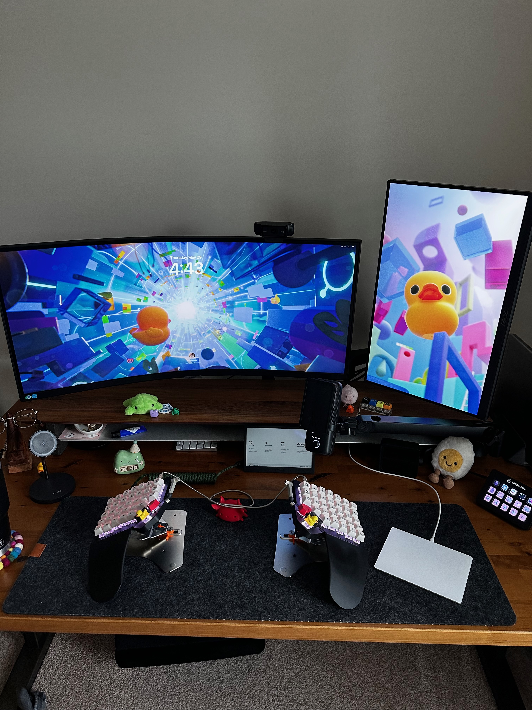
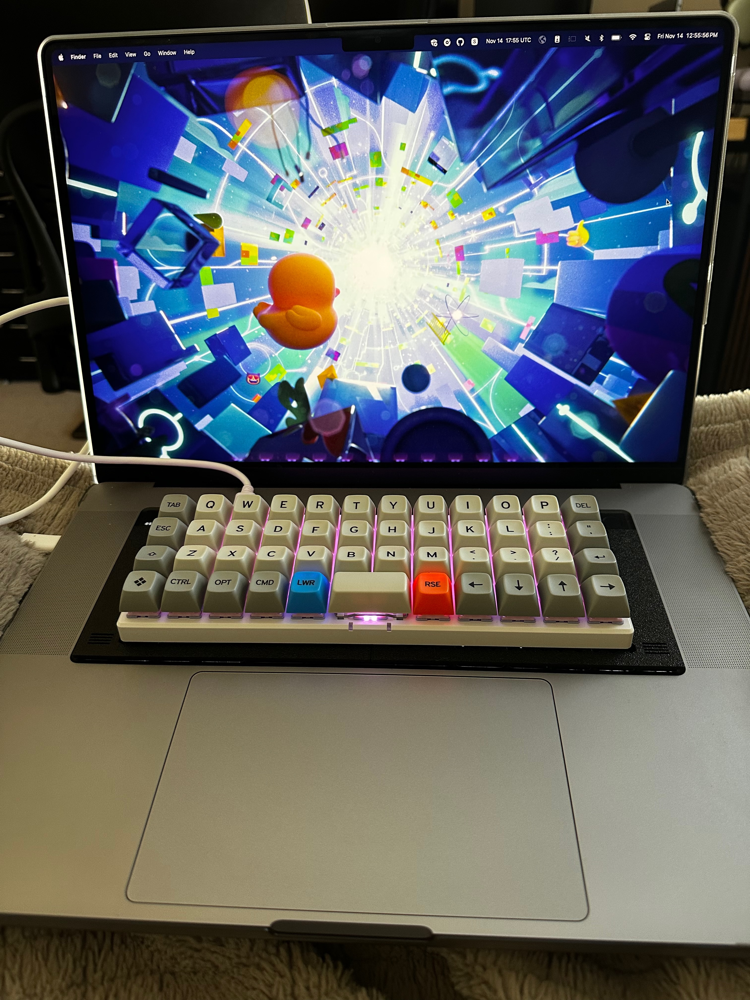
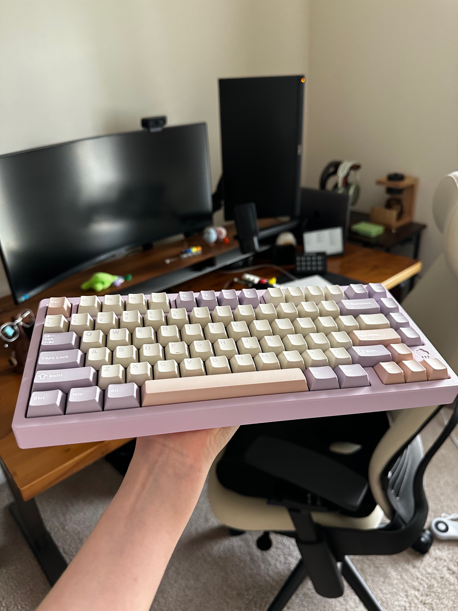
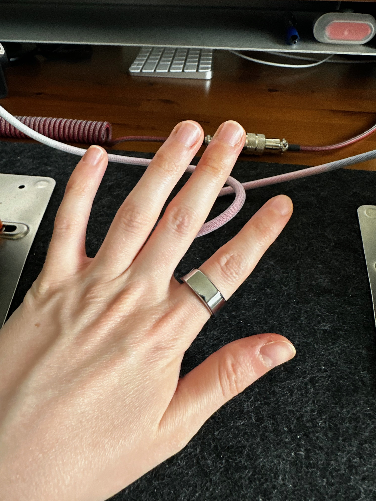

As developers, we're fairly aware of tech stacks for services and companies, but I love the idea of a tech stack that supports you and your life! Mine changes probably too much, but I'd like to take a moment to reflect on the hardware and software in my life at this point in time.

## Hardware

### Phone
I used to be an Android girly, but I swapped to Apple in 2020 and have begrudingly embraced the walled garden. I'm using an iPhone 14 Pro right now which still works fairly well aside from the battery getting a little worse for wear. I might upgrade to the 17 Pro soon but it's only because I have phone upgrade funds to use and nothing to do with the current performance.

### Computer
As mentioned above, I am bought into the Apple ecosystem. I owe the Mac preference really to my first job. I just love a unix based system. I know Windows has gotten better since I've used it as my primary machine, but the Mac just works so well. I have given Linux a shot, but found myself debugging my OS more often than I'd like.

I do use a Windows PC for gaming! It's perfectly fine for that, though I do find myself fighting against Windows a lot, but I think that's more because I don't have the right mental model for using it. I do wish it would not reset my settings back to default after every update!

### Accessories
Again, I have Airpods 2 (I think) for earbuds. They're perfect in every way except fit, but I think I have an odd ear shape. I do have Airpods Max which look gorgeous, but is _so heavy_. I prefer the Sony WH-1000XM4s for listening to music and traveling because they're so much lighter and sound a lot better.

I use the Elgato Wave as my microphone and a very basic Logitech webcam. I might look to upgrade the webcam this year.

### Keyboards!
I finally upgraded my switches this year and have a keyboard setup I like! My desk keyboard is the ZSA Moonlander with Huano Sakuras. It's so comfy to type on now and sounds impeccable. My travel keyboard is a Planck from ZSA (that's now discontinued, but you can get a Planck from many places). I replaced the Cherry Browns with Akko V3 Fairy Linear Silents so I wouldn't feel terrible bringing it with me to my coworking space. It's actually more quiet than the default Mac keyboard now and still feels great!

I game with a Rainy75. I wish I could copy its sound to all my other keyboards because it is so nice!!

### Tablet/E-reader
I've been waffling on buying an iPad mini for a while. I finally bit the bullet and got it and honestly I regret not doing it sooner. It's a great e-reader, second screen, notepad, sheet music, etc. All that while being so portable! I haven't picked up my Kindle in quite a while because the Kindle app on iPad is way better.

### Health
I've stopped wearing my Apple Watch because of wrist issues and not wanting to have a mini-phone on me at all times. I now use Oura which I do like a lot! It passively monitors and it adjusts goals based on where you are rather than pushing for perfection like Apple did. The only downside is it's not the most sturdy so it's difficult to wear while working out.

## Software

### Notetaking
Things are a little chaotic here. I have Obsidian and really want to make it work but I find it hard to continuously take notes and feel organized. Maybe I haven't figured out the right plugins for my uses, but it's been a struggle.

When I need to take handwritten notes, I've been reaching for Apple Freeform. It feels like FigJam but is free, so it works for me.

I tried VoiceNotes for a stint for an audio transcriptions. It was fine, but I can't use it for work things because of AI, so the subscription fee didn't feel super worth it.

### Coding
I'll write a more in-depth post about this, but I have continued to use Neovim! It's so extensible and I've honestly had zero issues with feature parity to other editors. This includes AI agents and such too.

I switched from iTerm2 to Ghostty this year and haven't looked back. iTerm2 was doing more than I want my terminal to do. Ghostty is mostly perfect with nearly zero additional setup.

I've been using Bruno as a cURL client. It's pretty good! I love that it's open source and privacy-concious. I don't love that everything _has_ to be in a collection so if I make a cURL request, I have to figure out a collection to put it in.

I of course use GitHub for code storage, CI/CD, project tracking, and so on. Since working there I've discovered there are few problems that it can't solve!

### AI
I use GitHub Copilot for most coding AI usage and coding agent tasks. I use Claude for personal AI chats. I may re-signup for ChatGPT since it's audio functionality is really nice, but it's not a strong need at this point.

### Conversation
My favorite chat app would probably be Discord. It's really awesome for communities and gaming and I think their free offering is very fair. I did start paying for the full membership this year, but I don't mind supporting it.

Other than that, I really like Signal as a privacy-first chat app. I still use Telegram a bit but I find myself enjoying Signal more.

Slack is great for work, but I really do not enjoy it for anything non-work related. Its free tier is extremely limited and frustrating.

### Trackers
I use How We Feel for emotion tracking. I think it's a lovely app with a great UX. And I like their privacy philosophy! I have been using Natural Cycles for cycle tracking. I think it's fine if you have a typical cycle but is a little frustrating as someone with a chaotic cycle. I've used HabitKit off and on this year for habit tracking.

I've been using Goodreads and Fable for book tracking. They're fine but far from perfect.

### Music
I use Spotify, but have been tempted to consider Apple Music given some choices Spotify has made recently. It is fine as a music app though, and I do love that they've made it easy to share a queue recently, especially via CarPlay.

### Etc.
I've really enjoyed Crouton for recipe storage! Google Calendar and Gmail for calendar/email just works and I haven't found a reason to change.

## Conclusion
I thought this would be a short little post, but it was fun to reflect on what tech I put in my life! Would love to know what your tech stack is, or if you have recommendations for note taking!
